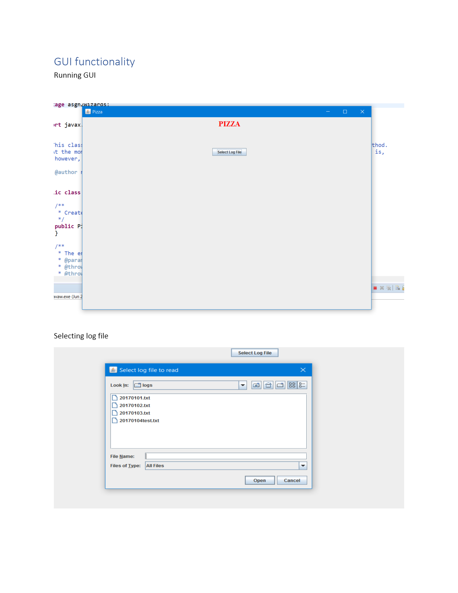

# Pizza Palace

# The Project
Pizza Palace is a restaurant in West End, Brisbane, the would like you to develop a logging system that records orders placed at their
restaurant. They would like you to produce a system that interprets the logs and displays the
information on a Graphical User Interface (GUI).

The Project was written in Java and using the swing GUI library, the project was also done in paires to help teach how to program in the
real world and to check over each other work. There is also over 100 unit test to help produce the best code possible and help iron out the bugs.

# My opinion
The swing library is outed, unit tests are hell.

# Screenshots

